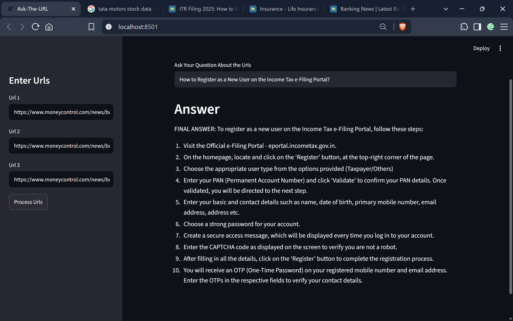

# Ask-The-URL

A Retrieval-Augmented Generation (RAG) application that lets users ask questions about website content using LangChain, FAISS, HuggingFace Embeddings, Groq Llama, and Streamlit.

## Screenshot

